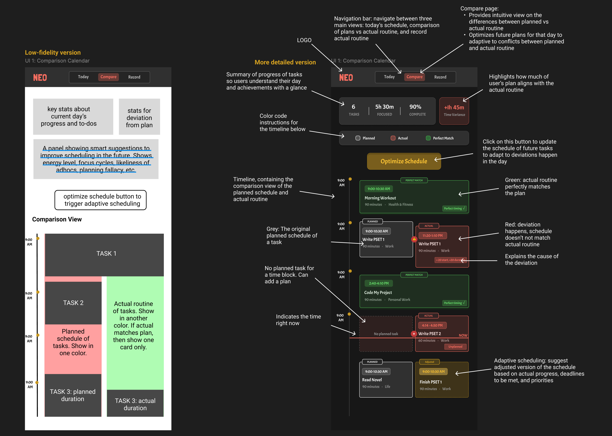
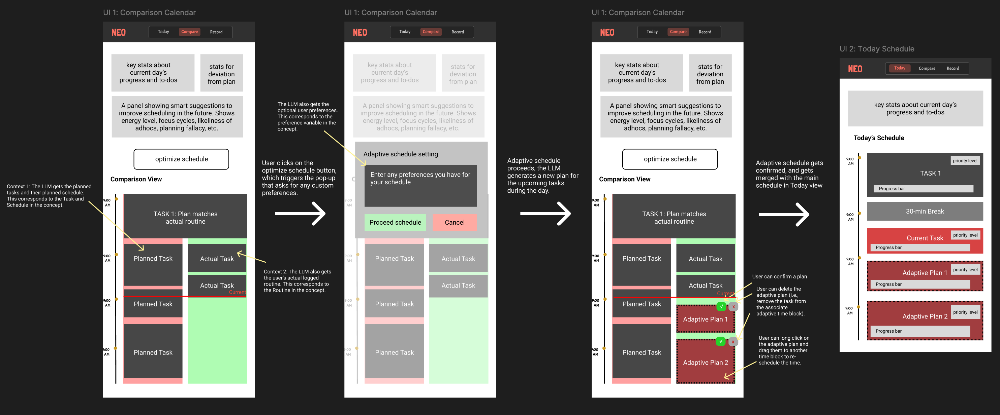
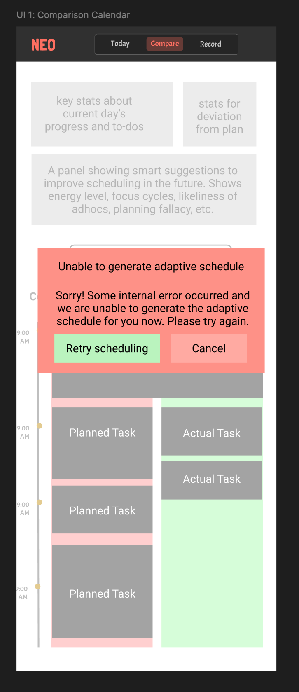

# Part one: Concept Augmentation

In my original [concept specification](https://github.com/Avril-Cui/61040-portfolio/blob/main/assignments/assignment2.md), one concept that relies heavily on AI augmentation is `AdaptiveSchedule`. Below is my original specification:

## AdaptiveSchedule: original version

AdaptiveSchedule ensures that the user’s schedule remains realistic when plans diverge from reality. It consumes generic inputs like tasks, schedule, and routine, and produces new adaptive blocks without altering those original concepts. AdaptiveSchedule maintains independence while optimizing schedules. It functions as a separate, adaptive layer that responds dynamically to RoutineLog and updates plans accordingly.

The generic parameters are instantiated as follows:

- User is bound to the system’s registered end users, each of whom owns and manages their own set of tasks
- Task will be instantiated when users create task objects stored in TaskCatalog
- Schedule will be instantiated when users create schedules of tasks stored in ScheduleTime
- Routine will be instantiated when users logs sessions stored in RoutineLog

All of these external types are completely generic, and AdaptiveSchedule makes no assumption about their internal structure.

```
concept AdaptiveSchedule [User, Task, Schedule, Routine]

purpose
    keeps the schedule responsive by moving, canceling, or creating tasks scheduled at future time blocks when reality diverges to ensure that highest priority tasks are achieved first, optimizing productivity

principle
    when actual sessions overruns or diverges from the plan, the scheduler adjusts subsequent planned tasks

state
    a set of AdaptiveBlocks with
        a timeBlockId String // this is a unique id
        an owner User
        a start Time
        an end Time
        a taskIdSet set of Strings // contains unique ids

actions
    addTimeBlock (owner: User, start: Time, end: Time)
        requires:
            no adaptive time block exists with this owner, start, and end
        effect:
            create a new adaptive time block $b$ with this owner, start, and end;
            assign $b$ an empty set of tasks;

    createAdaptiveSchedule (owner: User, tasks: set of Task, schedule: Schedule, routine: Routine)
        effect:
            based on (task, schedule, and routine), adaptively generate a new schedule of tasks by assigning active tasks to the corresponding AdaptiveBlock under this owner

```

## AdaptiveSchedule: AI-augmented version

We can see that in the original concept, the `createAdaptiveSchedule` action takes in task, schedule, and routine as input, then adaptively generate a new schedule of tasks for future events. This original concept blackboxed the process of generating an adaptive schedule, and there can be many ways to achieve the actions. For example:

1. We can display user their current task, schedule, and routine, and they manually adjust their future schedule.
2. Program a rule-based algorithm that adjust the schedule based on rules.
3. Augment with AI so that the LLM-empowered agent will generate the adaptive schedule for the user based on current ask, schedule, routine, and their optional preferences.

We can see that the AdaptiveSchedule concept is uniquely suited for AI augmentation because its core function is to continuously adjusting schedules based on real-world deviations, which requires flexible reasoning, contextual synthesis, and adaptive prioritization that go beyond deterministic rule-based logic. Augmenting it with AI makes the app unique and provides a smooth user experience. As discussed in class, LLMs excel at reasoning and synthesis tasks, where rigid algorithms fall short. The concept also illustrates a rough-edged problem, which is a domain LLMs are good at.

Below is the augmented concept:

```
concept AdaptiveSchedule [User, Task, Schedule, Routine]

purpose
    keeps the schedule responsive by moving, canceling, or creating tasks scheduled at future time blocks when reality diverges to ensure that highest priority tasks are achieved first, optimizing productivity

principle
    when actual sessions overruns or diverges from the plan, the adaptive scheduler adjusts subsequent planned tasks onto adaptive time blocks;
    then, the user can observe the adaptively adjusted schedule

state
    a set of AdaptiveBlocks with
        a timeBlockId String // this is a unique id
        an owner User
        a start Time
        an end Time
        a taskSet set of Task

    a set of droppedTasks with
        a taskId String

actions
    addTimeBlock (owner: User, start: Time, end: Time) : (timeBlockId: String)
        requires:
            start and end are valid times;
            start is before end;
            no adaptive time block exists with this owner, start, and end;
        effect:
            create a new adaptive time block $b$ with this owner, start, and end;
            assign $b$ an empty set of tasks;
            return the timeBlockId of the newly created adaptive time block;

    createAdaptiveSchedule (owner: User, tasks: set of Task, schedule: Schedule, routine: Routine)
        effect:
            based on (task, schedule, and routine), adaptively generate a new schedule of tasks by assigning active tasks to taskSet of the corresponding AdaptiveBlock under this owner

    async requestAdaptiveScheduleAI (owner: User, task: Task, schedule: Schedule, routine: Routine, preference: Preference, llm: GeminiLLM): (adaptiveBlock: AdaptiveBlock)
        effect:
            AI-assisted adaptive scheduling LLM first analyzes the difference between schedule and routine, and reasons the possible causes of deviation;
            it considers hardwired user preference;
            it considers the original planned schedule of task;
            it considers information provided by attributes in task;
            it also considers other schedules represented by adaptive blocks owned by the user;
            after reasoning, the LLM assigns the task under the taskSet of one or more adaptive blocks owned by this user;
            if time is insufficient, prioritize tasks with urgent deadlines or higher priority and put the rest in droppedTaskIds;
            return the set of all AdaptiveBlocks owned by the user;

    unassignBlock (owner: User, task: Task, timeBlockId: String)
        requires:
            exists an adaptive block with matching owner and timeBlockId;
            task exists in this time block's taskSet;
        effect:
            remove task from that block's taskSet
```

### Note

Here are some notes that worth highlighting:

1. For the purpose of separation of concerns and maintaining modularity between concepts, AdaptiveSchedule takes Task, Schedule, Routine as generic types. This is because the specific concept within these types will not influence how AdaptiveSchedule works. However, since we are implementing the concept in this assignment, it is worth mentioning what these types are.

   - Task refers to the set of tasks specified by the user. It is managed under the TaskCatalog concept and has the following structure:
     ```
     a set of Tasks with
         an owner User
         a taskID String
         a taskName String
         a category String
         a duration Duration
         a priority Number
         a splittable Flag
         a timeBlockSet containing a set of Strings (optional) // these strings are timeBlockIds
         a deadline TimeStamp (optional)
         a slack String (optional) // buffer margin for acceptable deviation
         a preDependence set of Tasks (optional) // tasks that it depends on
         a postDependence set of Tasks (optional) // tasks that depend on it
         a note String (optional)
     ```
   - Schedule refers to the set of time blocks, and it is the user's intended/planned allocation of tasks under each time. It is managed under the ScheduleTime concept and has the following structure:
     ```
     a set of TimeBlocks with
         a timeBlockId String // this is a unique id
         an owner User
         a start Time
         an end Time
         a taskIdSet set of Strings // contains unique ids
     ```
   - Routine refers to the set of sessions, and it is the user's actual recorded routine of the day (i.e., what they actually did). It is managed under the RoutineLog concept and has the following structure:
     ```
     a set of Sessions with
         an owner User
         a sessionName String
         a sessionId String    \\ this is an unique ID
         an isPaused Flag
         an isActive Flag
         a start Time (optional)
         an end Time (optional)
         a linkedTask Task (optional)
         an interruptReason String (optional)
     ```

2. When the user is adaptively planning their future schedule, they are already provided all information (a set of all Tasks, Schedule, Routine) in the frontend. If we want the LLM to generate an adaptive schedule, we first provide it all the necessary information. These information are needed because:

   1. The LLM needs to know what are the incomplete tasks and pending plans. That's why we give it some incomplete task and Schedule.
   2. To achieve better adaptive scheduling that meets the purpose of my app, the LLM needs to understand what might be the reasons that caused the user's originally planned schedule to deviate from their actual routine. The users can understand so from the compare view in the app (see my previous assignment), but the LLM can only know if it is given the recorded set of Sessions.

3. Preference is a list of hardwired user preferences about the schedule. In the actual app, we might have another AI extracting and generating the user preference based on their previous schedule and recorded sessions. But for now, for the sake of simplicity, we assume that these preferences are hardwired (and the users will input them in the frontend).

4. By integrating an LLM-powered action `requestAdaptiveScheduleAI`, the concept achieves a boost in capacity. The LLM acts as a mixed-initiative partner, automating what it can (adaptively rescheduling tasks) while still allowing the user to retain final control.

5. I did not add the invariant constraint that only one task is allowed for an adaptive block. This is because some times the user may hope to execute multiple tasks concurrently. For example, they can schedule do laundry and do homework both at 4pm-5pm, because they only need to put laundry in the laundry machine, then go back to work. However, I will add in the prompt to the LLM that, unless the tasks can be executed concurrently, don't schedule multiple tasks under the same time block.

# Part two: User interaction design

## Wireframe from last time

The compare page is where we implement the `AdaptiveSchedule` concept. This page is key to Neo. It shows a side-by-side comparison of the planned schedule versus the actual routine/sessions the user recorded. It highlights perfect matches, mismatches, and unplanned tasks, and shows how the actual routine deviates from the plans.

Instead of punishing users for failing to "stick to the plan" and leave them with no solution for the resulting chaos, Neo reframes deviations as learning opportunities. This page gives visibility into how real life differed from plans. Neo also offers a solution to optimize the schedule. By clicking on the "Optimize Schedule" button, Neo re-adjusts remaining tasks/plans in the day to account for deviations, helping users meeting top priorities and deadlines. Neo helps users update the day dynamically.

Last time, I made two UI designs, a low fidelity wireframe to help understand the key components in the interface, and a more detailed UI design to show more details that are needed to optimize the user experience. I will display both versions here:



## AI augmentation interaction and user journey

The user begins their user interaction with `AdaptiveSchedule` after they land on the Compare page, where they can visually inspect discrepancies between their planned schedule and actual routine. Upon noticing misalignment and realized that they might not be able to finish their top priorities if they stick to their original plan, they click on the "Optimize Schedule" button. This triggers a pop-up panel prompting them to input any custom scheduling preferences (e.g., "I need focus time after dinner" or "avoid long sessions tonight"). Once the user confirms, the system sends some contextual inputs to the LLM: the current incomplete Tasks, the planned Schedule, and the logged Routine (to understand what each specifically mean, check the previous section or annotations in the sketch below), along with any optional user preferences.

The LLM then reasons through the provided context. It compares the original plan with the actual routine, infers causes of deviation (like fatigue, over-ambitious goals, or interruptions), and proposes an adaptive schedule for the rest of the day. The new adaptive schedule blocks are then shown in the timeline (as red blocks in the sketch below), clearly labeled and positioned under the updated time slots. If any error occurs while the LLM is generating the adaptive schedule, an error pop-up is shown (see below).

Otherwise, if no error occurs, the user can review these adaptive suggestions generated by the LLM, delete a proposed block, or drag and drop it to a different time slot for manual adjustment to make sure that users have control over the AI-generated outputs.

If the user confirms the adaptive plan, the plan gets merged seamlessly into the main schedule in the Today view (for more information, check my assignment 2), where users can look at the pending plans/schedules for the rest of the day.

This end-to-end interaction demonstrates mixed-initiative collaboration, where the AI provides intelligent, context-aware support, while the user remains the final decision-maker.



And if error occurs (i.e., during edge cases), the UI will show the following pop-up:



# Part three: Implement the concept

## Prompt-v1

When first implementing the concept, I used a basic prompt (prompt-v1). I further refined this prompt based on edge test cases I experimented with later.

```
You are a helpful AI assistant that creates optimal adaptive schedules for users based on task analysis, planned schedules, actual routines, and user preferences.

USER: ${owner}
${currentTimeSection}

USER PREFERENCES:
${preference.preferences.map((p) => `- ${p}`).join("\n")}

TASKS TO SCHEDULE:
${this.tasksToString(tasks)}

PLANNED SCHEDULE (Original Plan):
${this.scheduleToString(schedule)}

ACTUAL ROUTINE (What Actually Happened):
${this.routineToString(routine)}

EXISTING ADAPTIVE BLOCK:
${existingBlocksSection}

TASK PRIORITY SCALE (1-5), determines how urgent the task is:
- Priority 1 (Critical): Must be done ASAP - urgent deadlines, emergencies
- Priority 2 (Important): Should be done soon - upcoming deadlines, high impact
- Priority 3 (Regular): Necessary but not urgent
- Priority 4 (Low): Can be done later
- Priority 5 (Optional): Can be done if time permits - not time-sensitive or important

CRITICAL REQUIREMENTS:
1. ONLY schedule the tasks listed above - do NOT add any new tasks
2. Ensure all scheduled blocks have valid ISO timestamps
3. Assign tasks based on priority and deadline urgency
4. Consider the actual routine and how it deviates from the schedule to understand what time blocks are realistic
5. Provide reasoning for why actual routine deviated from the original planned schedule
6. For a task with a long duration and is splittable, consider splitting it into multiple non-consecutive time blocks for better focus
7. If time is insufficient to schedule all tasks, prioritize tasks with urgent deadlines (approaching soon) or higher priority (1-2); put lower priority tasks or tasks without urgent deadlines in droppedTaskIds

Return your response as a JSON object with this exact structure:
{
"analysis": "Brief analysis of why the schedule deviated from the routine and key insights",
"adaptiveBlocks": [
    {
    "start": "ISO timestamp",
    "end": "ISO timestamp",
    "taskIds": ["taskId1", "taskId2"]
    }
],
"droppedTaskIds": ["taskId3", "taskId4"]
}

Return ONLY the JSON object, no additional text.`;

```

# Part four: Explore richer test cases and prompts

I experimented with four test cases, three of them involved the LLM call, and the other one involved manual adaptive time block creation.

## Test 0: Manual Adaptive Time Block Creation

This test case shows how the test case runs without LLM (i.e., the user does the adaptive scheduling process themselves).

```
🧪 TEST CASE 1: Manual Time Block Creation
⏰ Creating time blocks manually...
✅ Created block: adaptive-block-0
✅ Created block: adaptive-block-1

📝 Manually assigning tasks to blocks...
✅ Assigned "Finish 6.1040 pset" to adaptive-block-0
✅ Assigned "Review for 6.3900 exam" to adaptive-block-1

🔄 Adaptive Schedule:
------------------------------------------

⏰ 2:00 PM UTC - 3:30 PM UTC
   Block ID: adaptive-block-0
   Tasks:
   - Finish 6.1040 pset (Priority: 2, Duration: 90 min)

⏰ 4:00 PM UTC - 5:00 PM UTC
   Block ID: adaptive-block-1
   Tasks:
   - Review for 6.3900 exam (Priority: 3, Duration: 60 min)
```

## Test 1: Basic AI Adaptive Scheduling

This schedule has no concurrent/conflicting plans, dependencies, or unfinished tasks. Prompt-v1 works well in this case.

Overview

```
⏰ Current time (fixed for testing): 2025-10-04T13:00:00Z (1:00 PM) \
📝 Unfinished tasks to schedule: 5 \
📅 Original planned schedule blocks: 5 \
📊 Actual routine sessions so far: 2 \
🤖 Requesting adaptive schedule from Gemini AI... \
```

📅 Original Schedule

```
⏰ 9:00 AM UTC - 11:00 AM UTC
   Block ID: planned-1
   Tasks:
   - Complete Project Proposal (Priority: 1, Duration: 120 min)

⏰ 2:00 PM UTC - 3:00 PM UTC
   Block ID: planned-2
   Tasks:
   - Review Pull Requests (Priority: 2, Duration: 45 min)

⏰ 5:00 PM UTC - 6:00 PM UTC
   Block ID: planned-3
   Tasks:
   - Gym Workout (Priority: 3, Duration: 60 min)

⏰ 6:00 PM UTC - 6:30 PM UTC
   Block ID: planned-4
   Tasks:
   - Prepare Dinner (Priority: 3, Duration: 30 min)

⏰ 7:00 PM UTC - 7:30 PM UTC
   Block ID: planned-5
   Tasks:
   - Study Spanish (Priority: 4, Duration: 30 min)
```

📊 Actual Routine (What Actually Happened):

```
⏰ 9:00 AM UTC - 10:30 AM UTC
   Session: Morning Meeting
   Status: Inactive
   Interrupt Reason: Unexpected urgent meeting took longer than expected

⏰ 10:30 AM UTC - 11:00 AM UTC
   Session: Started Project Proposal
   Status: Inactive, Paused
   Linked Task: Complete Project Proposal
   Interrupt Reason: Had to stop due to lunch break, only completed 30 minutes
```

🔄 Adaptive Schedule (AI-Generated):

```
⏰ 1:00 PM UTC - 2:30 PM UTC
   Block ID: adaptive-block-0
   Tasks:
   - Complete Project Proposal (Priority: 1, Duration: 90 min)

⏰ 2:30 PM UTC - 3:15 PM UTC
   Block ID: adaptive-block-1
   Tasks:
   - Review Pull Requests (Priority: 2, Duration: 45 min)

⏰ 5:00 PM UTC - 6:00 PM UTC
   Block ID: adaptive-block-2
   Tasks:
   - Gym Workout (Priority: 3, Duration: 60 min)

⏰ 6:00 PM UTC - 6:30 PM UTC
   Block ID: adaptive-block-3
   Tasks:
   - Prepare Dinner (Priority: 3, Duration: 30 min)

⏰ 7:00 PM UTC - 7:30 PM UTC
   Block ID: adaptive-block-4
   Tasks:
   - Study Spanish (Priority: 4, Duration: 30 min)
```

## Test 2: Task-dependencies AI Adaptive Scheduling

This test case assesses how well the AdaptiveScheduler works when tasks have dependencies (preDependence/postDependence). The original prompt fails sometimes, especially if task A has very high priority, but task A depends on task B (and sometimes the model will place A before B, ignoring the dependency constraint). I concluded the reason is that it does not give the LLM a set of rules it should obey. So, I created an updated version that more explicitly state all the scheduling constraints, which performs well on the test case related to task-dependencies.

### Prompt-v2

```
You are a helpful AI assistant that creates optimal adaptive schedules for users based on task analysis, planned schedules, actual routines, and user preferences.

USER: ${owner}
${currentTimeSection}

USER PREFERENCES:
${preference.preferences.map((p) => `- ${p}`).join("\n")}

TASKS TO SCHEDULE:
${this.tasksToString(tasks)}

PLANNED SCHEDULE (Original Plan):
${this.scheduleToString(schedule)}

ACTUAL ROUTINE (What Actually Happened):
${this.routineToString(routine)}

EXISTING ADAPTIVE BLOCK:
${existingBlocksSection}

TASK PRIORITY SCALE (1-5), determines how urgent the task is:
- Priority 1 (Critical): Must be done ASAP - urgent deadlines, emergencies
- Priority 2 (Important): Should be done soon - upcoming deadlines, high impact
- Priority 3 (Regular): Necessary but not urgent
- Priority 4 (Low): Can be done later
- Priority 5 (Optional): Can be done if time permits - not time-sensitive or important

SCHEDULING CONSTRAINTS:
- Times must be in ISO 8601 format (e.g., "2025-10-04T14:00:00Z")
- Start time must be before end time
- ALL time blocks MUST start at or after the CURRENT TIME if provided
- **CRITICAL: Time block duration MUST be at least as long as the total duration of tasks assigned to it**
- For non-splittable tasks, the block must be at least as long as the task duration
- For splittable tasks, you can either: (1) create a single block with duration >= task duration, OR (2) split across multiple blocks where sum of block durations >= task duration
- High priority tasks should be scheduled first
- Respect task deadlines
- Consider dependencies (preDependence tasks must be scheduled before dependent tasks)
- If a task is splittable, it can be divided across multiple blocks. Otherwise, do not divide it across multiple **non-consecutive blocks**.
- Allow multiple tasks per block ONLY if they can be done concurrently

CRITICAL REQUIREMENTS:
1. ONLY schedule the tasks listed above - do NOT add any new tasks
2. Ensure all scheduled blocks have valid ISO timestamps
3. Assign tasks based on priority and deadline urgency
4. Consider the actual routine and how it deviates from the schedule to understand what time blocks are realistic
5. Provide reasoning for why actual routine deviated from the original planned schedule
6. For a task with a long duration and is splittable, consider splitting it into multiple non-consecutive time blocks for better focus
7. If time is insufficient to schedule all tasks, prioritize tasks with urgent deadlines (approaching soon) or higher priority (1-2); put lower priority tasks or tasks without urgent deadlines in droppedTaskIds

Return your response as a JSON object with this exact structure:
{
"analysis": "Brief analysis of why the schedule deviated from the routine and key insights",
"adaptiveBlocks": [
    {
    "start": "ISO timestamp",
    "end": "ISO timestamp",
    "taskIds": ["taskId1", "taskId2"]
    }
],
"droppedTaskIds": ["taskId3", "taskId4"]
}

Return ONLY the JSON object, no additional text.`;
```

### Test case performance

```
🧪 TEST CASE 3: Task Dependencies
==================================
📝 Total tasks: 3
🔗 Dependency chain: task-1 → task-2 → task-3
⏰ Current time: 11:30 AM

What happened:
  - Task 1: Only 30/60 min completed (interrupted by meeting)
  - Task 2: Not started
  - Task 3: Not started

Expected adaptive behavior:
  - Complete remaining 30 min of Task 1 first
  - Then schedule Task 2 (depends on Task 1 completion)
  - Finally schedule Task 3 (depends on Task 2 completion)


⏰ Current Time: 11:30 AM UTC (2025-10-04T11:30:00Z)
==========================================

📋 Original Planned Schedule:
------------------------------------------
⏰ 9:00 AM UTC - 10:00 AM UTC
   Block ID: planned-1
   Tasks:
   - Research Paper Topic (Priority: 2, Duration: 60 min)

⏰ 10:00 AM UTC - 11:00 AM UTC
   Block ID: planned-2
   Tasks:
   - Create Paper Outline (Priority: 2, Duration: 60 min)

⏰ 11:00 AM UTC - 12:00 PM UTC
   Block ID: planned-3
   Tasks:
   - Write First Draft (Priority: 1, Duration: 60 min)

📊 Actual Routine (What Actually Happened):
------------------------------------------
⏰ 9:00 AM UTC - 9:30 AM UTC
   Session: Started Research
   Status: Inactive, Paused
   Linked Task: Research Paper Topic
   Interrupt Reason: Unexpected meeting interrupted - only completed 30 minutes of 60 minute task

⏰ 9:30 AM UTC - 11:30 AM UTC
   Session: Emergency Meeting
   Status: Inactive
   Interrupt Reason: Unplanned urgent meeting took 2 hours


🔄 Adaptive Schedule:
------------------------------------------
⏰ 11:30 AM UTC - 12:00 PM UTC
   Block ID: adaptive-block-0
   Tasks:
   - Research Paper Topic (Priority: 2, Duration: 30 min)

⏰ 12:00 PM UTC - 1:00 PM UTC
   Block ID: adaptive-block-1
   Tasks:
   - Create Paper Outline (Priority: 2, Duration: 60 min)

⏰ 1:00 PM UTC - 2:00 PM UTC
   Block ID: adaptive-block-2
   Tasks:
   - Write First Draft (Priority: 1, Duration: 60 min)
```

## Test 3: Test Deadline and Concurrency

This test cases is the most complex one, and will most mimic the real use cases when an user is actually using the app. Here, I test for

- Deadline constraints
- Some tasks (with lower priorities) will not be scheduled due to time constraints
- If concurrent task scheduling is used when it is possible
  There are many issues that occurred while running this test case. I decided instead of making more explicit rules for LLM, maybe guide the LLM's thought process will lead to more effective result. This ended up working, and I added an analysis guideline in the prompt. I also added an example to provide the LLM with more concrete context.

### Prompt-v3 (final version)

```
You are a helpful AI assistant that creates optimal adaptive schedules for users based on task analysis, planned schedules, actual routines, and user preferences.

USER: ${owner}
${currentTimeSection}

USER PREFERENCES:
${preference.preferences.map((p) => `- ${p}`).join("\n")}

TASKS TO SCHEDULE:
${this.tasksToString(tasks)}

PLANNED SCHEDULE (Original Plan):
${this.scheduleToString(schedule)}

ACTUAL ROUTINE (What Actually Happened):
${this.routineToString(routine)}

EXISTING ADAPTIVE BLOCK:
${existingBlocksSection}

TASK PRIORITY SCALE (1-5), determines how urgent the task is:
- Priority 1 (Critical): Must be done ASAP - urgent deadlines, emergencies
- Priority 2 (Important): Should be done soon - upcoming deadlines, high impact
- Priority 3 (Regular): Necessary but not urgent
- Priority 4 (Low): Can be done later
- Priority 5 (Optional): Can be done if time permits - not time-sensitive or important

ANALYSIS REQUIREMENTS:
1. Analyze the deviation between the planned schedule and actual routine
2. Identify tasks that were not completed or were interrupted
3. Consider task priorities (1 = highest priority, 5 = lowest priority), deadlines, and dependencies
4. Schedule critical tasks (priority 1-2) before lower priority tasks
5. Consider user preferences for scheduling
6. Respect task constraints (duration, splittable, slack)
7. Avoid scheduling multiple tasks in the same time block UNLESS they can be executed concurrently (e.g., laundry + homework)

SCHEDULING CONSTRAINTS:
- Times must be in ISO 8601 format (e.g., "2025-10-04T14:00:00Z")
- Start time must be before end time
- ALL time blocks MUST start at or after the CURRENT TIME if provided
- **CRITICAL: Time block duration MUST be at least as long as the total duration of tasks assigned to it**
- For non-splittable tasks, the block must be at least as long as the task duration
- For splittable tasks, you can either: (1) create a single block with duration >= task duration, OR (2) split across multiple blocks where sum of block durations >= task duration
- High priority tasks should be scheduled first
- Respect task deadlines
- Consider dependencies (preDependence tasks must be scheduled before dependent tasks)
- If a task is splittable, it can be divided across multiple blocks. Otherwise, do not divide it across multiple **non-consecutive blocks**.
- Allow multiple tasks per block ONLY if they can be done concurrently

CRITICAL REQUIREMENTS:
1. ONLY schedule the tasks listed above - do NOT add any new tasks
2. Ensure all scheduled blocks have valid ISO timestamps
3. Assign tasks based on priority and deadline urgency
4. **ABSOLUTE DEADLINE CONSTRAINT: If a task has a deadline, it MUST be completed BEFORE that deadline. Do NOT schedule any part of the task after its deadline.**
5. **If there is insufficient time to complete all tasks before their deadlines, you MUST drop the lowest priority tasks and put them in droppedTaskIds**
6. Consider the actual routine and how it deviates from the schedule to understand what time blocks are realistic
7. Provide reasoning for why actual routine deviated from the original planned schedule
8. For a task with a long duration and is splittable, consider splitting it into multiple non-consecutive time blocks for better focus
9. If time is insufficient to schedule all tasks, prioritize tasks with urgent deadlines (approaching soon) or higher priority (1-2); put lower priority tasks or tasks without urgent deadlines in droppedTaskIds

Return your response as a JSON object with this exact structure:
{
"analysis": "Brief analysis of why the schedule deviated from the routine and key insights",
"adaptiveBlocks": [
    {
    "start": "ISO timestamp",
    "end": "ISO timestamp",
    "taskIds": ["taskId1", "taskId2"]
    }
],
"droppedTaskIds": ["taskId3", "taskId4"]
}

EXAMPLE - If task-1 has deadline at 5 PM and current time is 12 PM:
- Available time: 5 hours (300 minutes)
- If task-1 needs 100 min + other high priority tasks need 200 min = 300 min total
- Low priority tasks (task-5, task-6) CANNOT fit before deadline
- CORRECT: Put task-5 and task-6 in droppedTaskIds
- WRONG: Schedule tasks after the 5 PM deadline

Return ONLY the JSON object, no additional text.`;
```

### Test case performance
```
🧪 TEST CASE 4: Deadlines and Concurrent Tasks
================================================
📝 Total tasks: 6
⏰ Current time: 12:00 PM
⚠️  URGENT: Assignment due at 5:00 PM (only 5 hours left!)

What happened:
  - Assignment: Only 20/120 min completed
  - Morning wasted on distractions (9:20 AM - 12:00 PM)
  - All other tasks: Not started

Time available: 5 hours (300 minutes)
Total work needed: 100 + 120 + 90 + 60 + 45 + 60 = 475 minutes
Deficit: 175 minutes - some tasks MUST be dropped!

Expected adaptive behavior:
  1. Prioritize finishing Assignment BEFORE 5 PM deadline (non-negotiable!)
  2. Schedule high-priority Study task (deadline tomorrow)
  3. Consider concurrent scheduling for Laundry
  4. DROP lowest priority tasks (examples are task-5 "Organize Notes" priority 5, task-6 "Clean Room" priority 4)
🤖 Requesting adaptive schedule from Gemini AI...


📋 Original Planned Schedule:
------------------------------------------
⏰ 9:00 AM UTC - 11:00 AM UTC
   Block ID: planned-1
   Tasks:
   - Submit Assignment (Priority: 1, Duration: 120 min)
⏰ 11:00 AM UTC - 1:00 PM UTC
   Block ID: planned-2
   Tasks:
   - Study for Exam (Priority: 2, Duration: 120 min)
⏰ 2:00 PM UTC - 3:30 PM UTC
   Block ID: planned-3
   Tasks:
   - Do Laundry (Priority: 3, Duration: 90 min)
⏰ 3:30 PM UTC - 4:30 PM UTC
   Block ID: planned-4
   Tasks:
   - Watch Lecture Recording (Priority: 4, Duration: 60 min)
⏰ 4:30 PM UTC - 5:15 PM UTC
   Block ID: planned-5
   Tasks:
   - Organize Notes (Priority: 5, Duration: 45 min)
⏰ 5:15 PM UTC - 6:15 PM UTC
   Block ID: planned-6
   Tasks:
   - Clean Room (Priority: 4, Duration: 60 min)

📊 Actual Routine (What Actually Happened):
------------------------------------------
⏰ 9:00 AM UTC - 9:20 AM UTC
   Session: Attempted Assignment
   Status: Inactive, Paused
   Linked Task: Submit Assignment
   Interrupt Reason: Got stuck, only worked 20 minutes out of planned 90
⏰ 9:20 AM UTC - 12:00 PM UTC
   Session: Distraction Period
   Status: Inactive
   Interrupt Reason: Wasted time on social media and other distractions

👤 User Preferences:
------------------------------------------
   1. CRITICAL: Must finish all work by 5:00 PM (17:00) - no exceptions, this is a hard deadline
   2. CRITICAL: Prioritize tasks with urgent deadlines first
   3. Schedule concurrent tasks (like laundry) alongside other work to save time
   4. Avoid dropping tasks with approaching deadlines
   5. If time is tight, drop lower priority tasks to meet the 5 PM deadline

🔄 Adaptive Schedule:
------------------------------------------
⏰ 12:00 PM UTC - 1:40 PM UTC
   Block ID: adaptive-block-0
   Tasks:
   - Submit Assignment (Priority: 1, Duration: 100 min)
⏰ 1:40 PM UTC - 3:00 PM UTC
   Block ID: adaptive-block-1
   Tasks:
   - Study for Exam (Priority: 2, Duration: 120 min)
⏰ 3:00 PM UTC - 3:45 PM UTC
   Block ID: adaptive-block-2
   Tasks:
   - Do Laundry (Priority: 3, Duration: 90 min)
   - Watch Lecture Recording (Priority: 4, Duration: 60 min)
⏰ 3:45 PM UTC - 4:30 PM UTC
   Block ID: adaptive-block-3
   Tasks:
   - Do Laundry (Priority: 3, Duration: 90 min)
   - Organize Notes (Priority: 5, Duration: 45 min)

🗑️ Dropped Tasks:
==========================================
❌ Clean Room
    Priority: 4 (Low)
    Duration: 60 minutes
    Reason: Insufficient time to schedule

⚠️  Analysis of Dropped Tasks:
================================
📋 Clean Room
   Priority: 4 (Low)
   Duration: 60 minutes
   Reason: Insufficient time to schedule before urgent deadline
```

# Part five: Add validators to your code
I noticed that even with well-scoped prompt, the LLM can sometimes generate problematic output with the following behaviors:
1. Invest or mis-reference tasks
2. Produce impossible schedules
3. Ignore real-world constraints like deadlines or dependencies
I added seven validators that catch these realistic mistakes and fail them with actionable errors so that the frontend or the users know how to respond. The validators can be found in the `validateSchedule` function. All validation errors are collected and printed with specific, human-readable reasons before throwing a single summary Error: LLM output failed validation... This makes failures debuggable and safe to re-prompt. For more details, check the `validateSchedule` function under `adaptiveschedule.ts`.

## Prevent hallucinations and contradictions
The LLM sometimes output task IDs that weren’t in the request, or mark a task both scheduled and dropped. In validateSchedule() Validator 1, I check for hallucinated tasks, which are any scheduled task not in the original list. In Validator 4, I check for contradictory state where a task appears both scheduled and in droppedTaskIds. In Validator 7, I verify that every dropped ID exists in the original set. These emit clear messages like "Hallucinated task ... was not in the original task list", "Task X is both scheduled AND dropped", or "Invalid dropped task: "${taskId}" was not in the original task list."

## Temporal correctness & non-overlap.
The model sometimes return invalid times or overlapping blocks. During parse (parseAndApplyAdaptiveSchedule) I validate timestamps (ISO parseable; start < end) and reject bad blocks. Then in validateSchedule() Validator 2, I detect overlapping time blocks and only allow them if both sides are explicitly concurrent (checked via canTasksBeConcurrent() looking for a "concurrent" note). 

## Deadlines and dependencies
As stated in the prompt section, I have refined my prompt to make sure that the LLM respect the deadlines and dependencies between tasks. However, the LLM may still schedule work past a deadline or forget prerequisites. In validateSchedule(), I enforce deadline compliance (Validator 5) by comparing each block's end against the task's deadline; and dependency ordering (Validator 6) by ensuring that every task's preDependence appears earlier in the scheduled order (or is explicitly dropped). Violations include messages like "Task A is scheduled before its dependency B" or "Task A ends after its deadline."
