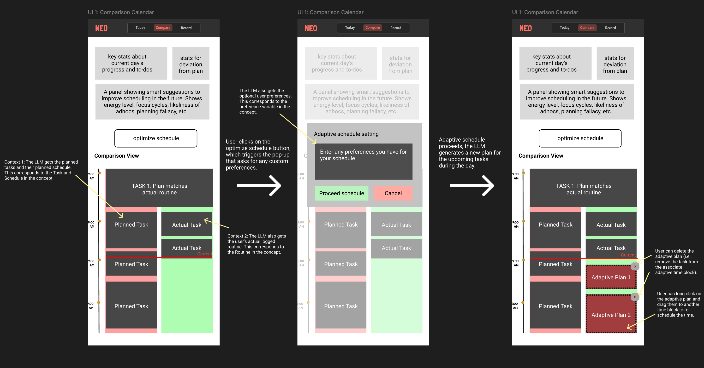

# Concept Augmentation

In my original [concept specification](https://github.com/Avril-Cui/61040-portfolio/blob/main/assignments/assignment2.md), one concept that relies heavily on AI augmentation is `AdaptiveSchedule`. Below is my original specification:

## AdaptiveSchedule: original version
AdaptiveSchedule ensures that the user’s schedule remains realistic when plans diverge from reality. It consumes generic inputs like tasks, schedule, and routine, and produces new adaptive blocks without altering those original concepts. AdaptiveSchedule maintains independence while optimizing schedules. It functions as a separate, adaptive layer that responds dynamically to RoutineLog and updates plans accordingly.

The generic parameters are instantiated as follows:
- User is bound to the system’s registered end users, each of whom owns and manages their own set of tasks
- Task will be instantiated when users create task objects stored in TaskCatalog
- Schedule will be instantiated when users create schedules of tasks stored in ScheduleTime
- Routine will be instantiated when users logs sessions stored in RoutineLog

All of these external types are completely generic, and AdaptiveSchedule makes no assumption about their internal structure.

```
concept AdaptiveSchedule [User, Task, Schedule, Routine]

purpose
    keeps the schedule responsive by moving, canceling, or creating tasks scheduled at future time blocks when reality diverges to ensure that highest priority tasks are achieved first, optimizing productivity

principle
    when actual sessions overruns or diverges from the plan, the scheduler adjusts subsequent planned tasks

state
    a set of AdaptiveBlocks with
        a timeBlockId String // this is a unique id
        an owner User
        a start Time
        an end Time
        a taskIdSet set of Strings // contains unique ids

actions
    addTimeBlock (owner: User, start: Time, end: Time)
        requires:
            no adaptive time block exists with this owner, start, and end
        effect:
            create a new adaptive time block $b$ with this owner, start, and end;
            assign $b$ an empty set of tasks;
    
    createAdaptiveSchedule (owner: User, tasks: set of Task, schedule: Schedule, routine: Routine)
        effect:
            based on (task, schedule, and routine), adaptively generate a new schedule of tasks by assigning active tasks to the corresponding AdaptiveBlock under this owner

```

## AdaptiveSchedule: AI-augmented version
We can see that in the original concept, the `createAdaptiveSchedule` action takes in task, schedule, and routine as input, then adaptively generate a new schedule of tasks for future events. This original concept blackboxed the process of generating an adaptive schedule, and there can be many ways to achieve the actions. For example:
1. We can display user their current task, schedule, and routine, and they manually adjust their future schedule.
2. Program a rule-based algorithm that adjust the schedule based on rules.
3. Augment with AI so that the LLM-empowered agent will generate the adaptive schedule for the user based on current ask, schedule, routine, and their optional preferences.

We can see that the AdaptiveSchedule concept is uniquely suited for AI augmentation because its core function is to continuously adjusting schedules based on real-world deviations, which requires flexible reasoning, contextual synthesis, and adaptive prioritization that go beyond deterministic rule-based logic. Augmenting it with AI makes the app unique and provides a smooth user experience. As discussed in class, LLMs excel at reasoning and synthesis tasks, where rigid algorithms fall short. The concept also illustrates a rough-edged problem, which is a domain LLMs are good at.

Below is the augmented concept:

```
concept AdaptiveSchedule [User, Task, Schedule, Routine]

purpose
    keeps the schedule responsive by moving, canceling, or creating tasks scheduled at future time blocks when reality diverges to ensure that highest priority tasks are achieved first, optimizing productivity

principle
    when actual sessions overruns or diverges from the plan, the adaptive scheduler adjusts subsequent planned tasks onto adaptive time blocks;
    then, the user can observe the adaptively adjusted schedule

state
    a set of AdaptiveBlocks with
        a timeBlockId String // this is a unique id
        an owner User
        a start Time
        an end Time
        a taskSet set of Tasks 

actions
    addTimeBlock (owner: User, start: Time, end: Time)
        requires:
            no adaptive time block exists with this owner, start, and end
        effect:
            create a new adaptive time block $b$ with this owner, start, and end;
            assign $b$ an empty set of tasks;
    
    createAdaptiveSchedule (owner: User, tasks: set of Task, schedule: Schedule, routine: Routine)
        effect:
            based on (task, schedule, and routine), adaptively generate a new schedule of tasks by assigning active tasks to the corresponding AdaptiveBlock under this owner
    
    requestAdaptiveScheduleAI (owner: User, task: Task, schedule: Schedule, routine: Routine, preference: Preference): (adaptiveBlock: AdaptiveBlock)
        effect:
            AI-assisted adaptive scheduling LLM first analyzes the difference between schedule and routine, and reasons the possible causes of deviation;
            it considers hardwired user preference;
            it considers the original planned schedule of task;
            it considers information provided by attributes in task;
            it also considers other schedules represented by adaptive blocks owned by the user;
            after reasoning, the LLM assigns the task under one or more adaptive blocks under this owner;
            return the set of all AdaptiveBlocks owned by the user;

    unassignBlock (owner: User, task: Task, timeBlockId: String)
        requires:
            exists an adaptive block with matching owner and timeBlockId;
            task exists in this time block's taskSet;
        effect:
            remove task from that block's taskSet
```

### Note
Here are some notes that worth highlighting:

1. For the purpose of separation of concerns and maintaining modularity between concepts, AdaptiveSchedule takes Task, Schedule, Routine as generic types. This is because the specific concept within these types will not influence how AdaptiveSchedule works. However, since we are implementing the concept in this assignment, it is worth mentioning what these types are.
    - Task refers to the set of tasks specified by the user. It is managed under the TaskCatalog concept and has the following structure:
        ```
        a set of Tasks with
            an owner User
            a taskID String
            a taskName String
            a category String
            a duration Duration
            a priority Number
            a splittable Flag
            a timeBlockSet containing a set of Strings (optional) // these strings are timeBlockIds
            a deadline TimeStamp (optional)
            a slack String (optional) // buffer margin for acceptable deviation
            a preDependence set of Tasks (optional) // tasks that it depends on
            a postDependence set of Tasks (optional) // tasks that depend on it
            a note String (optional)
        ```
    - Schedule refers to the set of time blocks, and it is the user's intended/planned allocation of tasks under each time. It is managed under the ScheduleTime concept and has the following structure:
        ```
        a set of TimeBlocks with
            a timeBlockId String // this is a unique id
            an owner User
            a start Time
            an end Time
            a taskIdSet set of Strings // contains unique ids
        ```
    - Routine refers to the set of sessions, and it is the user's actual recorded routine of the day (i.e., what they actually did). It is managed under the RoutineLog concept and has the following structure:
        ```
        a set of Sessions with
            an owner User
            a sessionName String
            a sessionId String    \\ this is an unique ID
            an isPaused Flag
            an isActive Flag
            a start Time (optional)
            an end Time (optional)
            a linkedTask Task (optional)
            an interruptReason String (optional)
        ```

2. When the user is adaptively planning their future schedule, they are already provided all information (a set of all Tasks, Schedule, Routine) in the frontend. If we want the LLM to generate an adaptive schedule, we first provide it all the necessary information. These information are needed because:
    1. The LLM needs to know what are the incomplete tasks and pending plans. That's why we give it some incomplete task and Schedule.
    2. To achieve better adaptive scheduling that meets the purpose of my app, the LLM needs to understand what might be the reasons that caused the user's originally planned schedule to deviate from their actual routine. The users can understand so from the compare view in the app (see my previous assignment), but the LLM can only know if it is given the recorded set of Sessions.

3. Preference is a list of hardwired user preferences about the schedule. In the actual app, we might have another AI extracting and generating the user preference based on their previous schedule and recorded sessions. But for now, for the sake of simplicity, we assume that these preferences are hardwired (and the users will input them in the frontend).

4. By integrating an LLM-powered action `requestAdaptiveScheduleAI`, the concept achieves a boost in capacity. The LLM acts as a mixed-initiative partner, automating what it can (adaptively rescheduling tasks) while still allowing the user to retain final control.

# User interaction design
## Sketches
### Wireframe from last time
The compare page is where we implement the `AdaptiveSchedule` concept. This page is key to Neo. It shows a side-by-side comparison of the planned schedule versus the actual routine/sessions the user recorded. It highlights perfect matches, mismatches, and unplanned tasks, and shows how the actual routine deviates from the plans.

Instead of punishing users for failing to "stick to the plan" and leave them with no solution for the resulting chaos, Neo reframes deviations as learning opportunities. This page gives visibility into how real life differed from plans. Neo also offers a solution to optimize the schedule. By clicking on the "Optimize Schedule" button, Neo re-adjusts remaining tasks/plans in the day to account for deviations, helping users meeting top priorities and deadlines. Neo helps users update the day dynamically.

Last time, I made two UI designs, a low fidelity wireframe to help understand the key components in the interface, and a more detailed UI design to show more details that are needed to optimize the user experience. I will display both versions here:


### AI augmentation interaction

